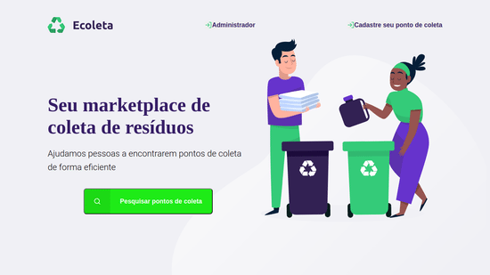

# Ecoleta 
## A ecoleta é um marketplace voltado para ajudar empresas e entidades de coleta de resíduos tanto orgânicos como inorgânicos a se conectar às pessoas e locais que precisam descartar seus resíduos de forma dequada e ecológica
### Projeto desenvolvido durante a 1° Next Level Week- Evento de tecnologia e programação oferecido pela <a href="https://www.rocketseat.com.br/">Rocketseat</a> com duração de uma semana lotada de conteúdos

### Tecnologias utilizadas:
* nunjucks
* express
* Node.Js
* Sqlite3
* API do IBGE para consumo dos endereços
# Licença
Esse projeto está sob a licença GNU General Public License v3.0. Veja o arquivo <a href="LICENSE">LICENSE</a> para saber mais

